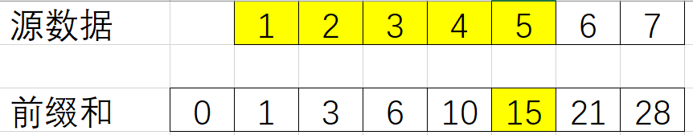
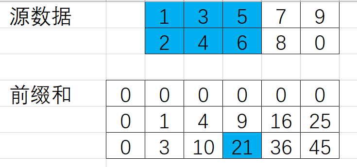

# 前缀和

一种数据预处理技术，先计算所有区间的区间和，就可以将计算区间和 

    a[i] + a[i+1] + a[i+2] + ... + a[i+k]

的时间复杂度从O(k)降为O(1)。

## 1. 一维前缀和



给定一个序列

```text
nums = [1, 2, 3, 4, 5, 6, 7]
```

定义前缀和数组prefix_sums，其长度为len(nums) + 1:

```python
n = len(nums)
prefix_sums = [0 for _ in range(n + 1)]
for i in range(n):
    prefix_sums[i + 1] = prefix_sums[i] + nums[i]
```

在该前缀和的定义下，计算i ~ j（包含）区域的序列和为：

```python
def _get_sum(i, j):
    return prefix_sums[j + 1] - prefix_sums[i]
```

## 2. 二维前缀和



给定一个矩阵

```text
matrix = [
  [1, 3, 5, 7, 9],
  [2, 4, 6, 8, 0]
]
```

其中m = len(matrix) = 2, n = len(matrix[0]) = 5

定义前缀和二维数组prefix_sums，其长度为(m+1) * (n+1):

```python
m = len(matrix)
n = len(matrix[0])

prefix_sums = [[0] * (n + 1) for _ in range(m + 1)]
for i in range(m):
    for j in range(n):
        prefix_sums[i + 1][j + 1] = prefix_sums[i][j + 1] + prefix_sums[i + 1][j] - prefix_sums[i][j] + matrix[i][j]
```

在该前缀和的定义下，矩阵[x0, y0] ~ [x1, y1]（包含）的区域和为:

```python
def _get_sum(x0: int, y0: int, x1: int, y1: int):
    return prefix_sums[x1 + 1][y1 + 1] - prefix_sums[x1 + 1][y0] - prefix_sums[x0][y1 + 1] + prefix_sums[x0][y0]
```

## 附录A. 参考文档

## 附录B. 注意事项

### B.1. 前缀和数组空间优化

若不需要维护所有i对应的前缀和，可以在遍历期间，只存储所需要i对应的前缀和即可。

```python
cached = {}
total = 0
for idx, value in enumerate(nums):
    total += value
    if need_cache(idx):
        cached[idx + 1] = total
```

### B.2. 不能修改nums元素值

若修改了nums[i]的值，那么prefix_sums中包含nums[i]的部分都需要更新，

如prefix_sums[i+1]、prefix_sums[i+2]、...、prefix_sums[n]，

最坏的情况下需要O(n)的时间复杂度才能将prefix_sums更新完成。

该场景可以使用线段树。

## 附录C. 题单

### [363. 矩形区域不超过 K 的最大数值和](https://leetcode.cn/problems/max-sum-of-rectangle-no-larger-than-k/description/)

- 二维前缀和简化计算矩阵区域和的复杂度
- 二分法查找满足prefix_sums[j+1] - prefix_sums[i] <= k的值