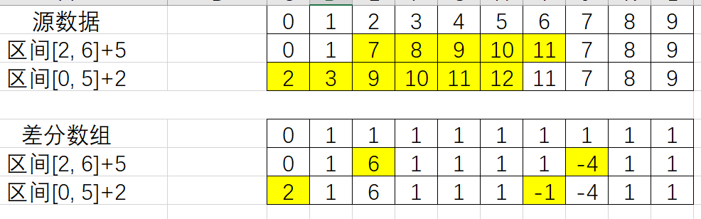
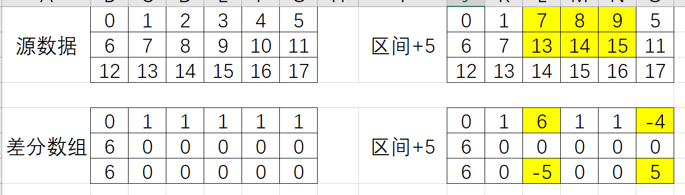

# 差分数组 (difference array)

一种数据预处理技术，先计算出区间相邻元素的差值，可以将区间

    a[i] += x、a[i+1] += x、......、a[i+k] += x

的累加操作的复杂度从O(k)降为O(1)。

## 1. 一维差分数组



给定一个序列

```text
nums = [0, 1, 2, 3, 4, 5, 6, 7, 8, 9]
```

定义差分数组diffs，长度为len(nums):

```python
from typing import List


def _get_diffs(nums: List[int]):
    n = len(nums)
    diffs = [0] * n
    diffs[0] = nums[0]
    for i in range(1, n):
        diffs[i] = nums[i] - nums[i - 1]
```

在该差分数组的定义下，针对原数组区间[i:j]（不含j）的累加d的操作，可以转换为

```python
from typing import List


def _accumulation(diffs: List[int], i: int, j: int, d: int):
    diffs[i] += d
    if j < len(diffs):
        diffs[j] -= d
```

在该定义下，如果要从差分数组还原原来的数组，只需要计算前缀和即可。

```python
from typing import List


def _get_origin_array(diffs: List[int]):
    n = len(diffs)
    origin = [0] * n
    origin[0] = diffs[0]
    for i in range(1, n):
        origin[i] = origin[i - 1] + diffs[i]
    return origin
```

## 2. 二维差分数组



```text
差分数组和前缀和数组互为逆运算。
二维前缀和数组（补充前缀0）的计算为S[i+1][j+1] = S[i+1][j]+S[i][j+1]-S[i][j]+a[i][j]
则a[i][j] = S[i+1][j+1]-S[i+1][j]-S[i][j+1]+S[i][j]
由于此处差分数组并不需要补充前缀0占位，因此
a[i][j] = S[i][j]-S[i][j-1]-S[i-1][j]+S[i-1][j-1]
```

对给定的矩阵matrix，定义二维差分数组diffs:

```python
from typing import List


def _get_diffs(matrix: List[List[int]]):
    m = len(matrix)
    n = len(matrix[0])

    diffs = [[0] * n for _ in range(m)]
    for i in range(m):
        for j in range(n):
            diffs[i][j] = matrix[i][j] + (matrix[i - 1][j - 1] if i > 0 and j > 0 else 0) - (
                matrix[i][j - 1] if j > 0 else 0) - (matrix[i - 1][j] if i > 0 else 0)            
```

若矩阵matrix在区间(x0, y0)、(x1, y1)（不包含）内每个元素需要+d，可以在diffs上操作：

```python
from typing import List


def _accumulation(diffs: List[List[int]], x0: int, y0: int, x1: int, y1: int, d: int):
    diffs[x0][y0] += d
    if x1 < len(diffs) and y1 < len(diffs[0]):
        diffs[x1][y1] += d
    if y1 < len(diffs[0]):
        diffs[x0][y1] -= d
    if x1 < len(diffs):
        diffs[x1][y0] -= d
```

在该定义下，如果要从差分数组还原原来的数组，只需要计算前缀和即可(使用diffs原地计算)。

```python
from typing import List


def _get_origin_array(diffs: List[List[int]]):
    m = len(diffs)
    n = len(diffs[0])

    for i in range(m):
        for j in range(n):
            diffs[i][j] = (diffs[i - 1][j] if i > 0 else 0) + (diffs[i][j - 1] if j > 0 else 0) - (
                diffs[i - 1][j - 1] if i > 0 and j > 0 else 0) + diffs[i][j]
    return diffs
```

```python

```

## 附录A. 参考文档

- https://mp.weixin.qq.com/s?__biz=MzU4NDE3MTEyMA==&mid=2247490329&idx=1&sn=6d448a53cd722bbd990fda82bd262857
-

## 附录B. 注意事项

## 附录C. 题单

### [2132. 用邮票贴满网格图](https://leetcode.cn/problems/stamping-the-grid/solutions/1199642/wu-nao-zuo-fa-er-wei-qian-zhui-he-er-wei-zwiu/)

- 二维前缀和判断区域是否可以覆盖
- 二维差分数组对区域累加